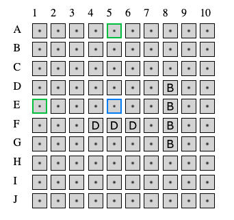

# Battleship

Battleship is a vanilla JS implementation of the classic board game, with the user playing against the computer. You can check out [the GitHub Pages site](https://mathpianop.github.io/battleship/), or follow the installation instructions below.

This project was done as part of The Odin Project curriculum (theodinproject.com). It was designed to practice unit testing with Jest. Due to the testing and the lack of a framework, I found it to be a good opportunity to practice good code organization and separation of responsibilities.


## Features

At the start of the game, the user places ships on the board by clicking on the endpoint positions. The app calculates which positions are possible as start and end positions, and only allows the user to choose legal endpoints. For example, the situation below shows the legal end points (green) for the Carrier ship, given the previous placements and the selected starting point (blue).

During this process, the user can opt to redo previous positionings.

The app uses an (imperfect) AI to supply the computer's moves. The AI chooses random positions until it gets a hit. It then attacks each of the adjacent positions until a second hit is obtained. At that point, the orientation of the ship is clear, and the AI chooses one of the two possible adjacent points, and so on until the ship is sunk. If the orientation becomes clear at any point before the second hit is obtained (due to neighboring hits/misses), the opposite pair of corresponding adjacent positions is eliminated.


## Install

If you want to run Battleship locally, start by cloning this repository.
```bash
git clone git@github.com:mathpianop/battleship.git
```
* Add dependencies
```bash
npm install
```
* Build in watch mode using Webpack
```bash
npm build:watch
```

* Run the test suite in watch mode using Jest
```bash
npm test
```